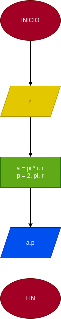

# area_perimetro_circulo

## analisis

Calcular area y perimetro de un circulo con las siguientes formulas teniendo la variable radio como entrada. formula-area-circulo  
a = pi*r**2  p = 2pi*r

## diseño 

## diagrama de flujo

  